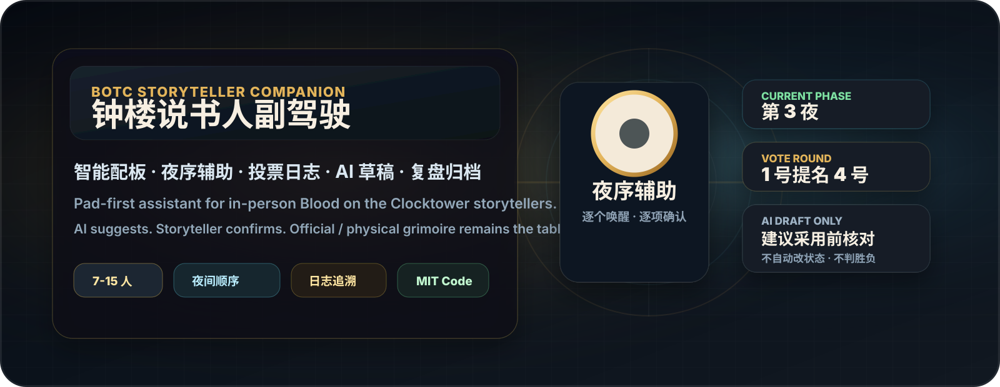
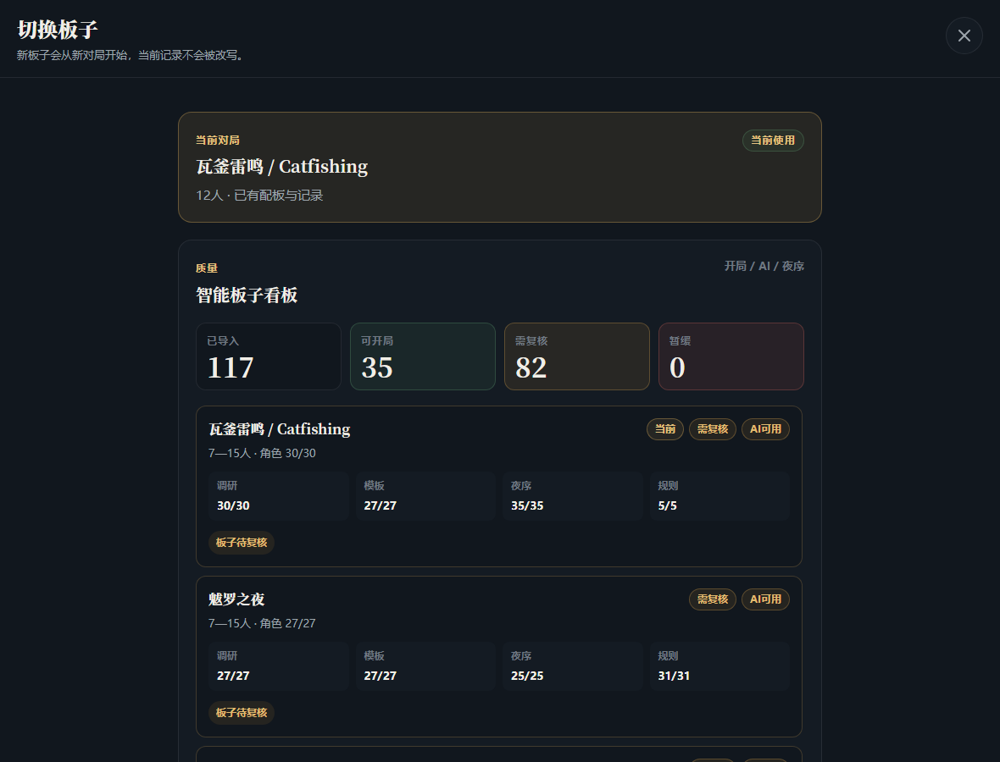
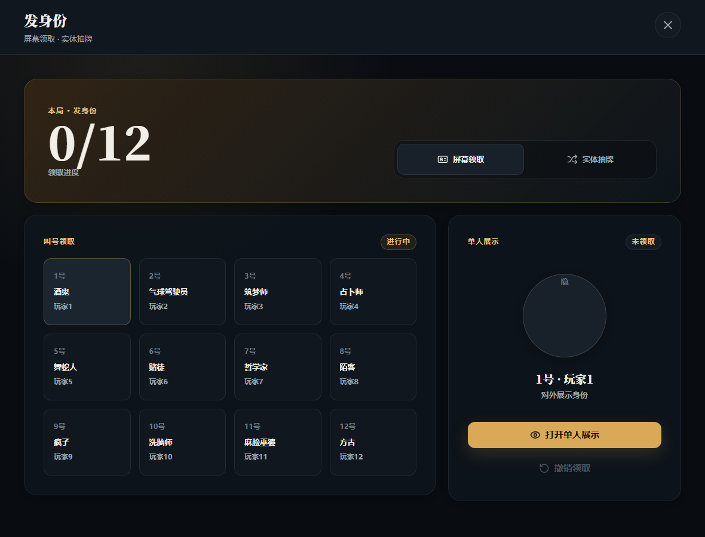
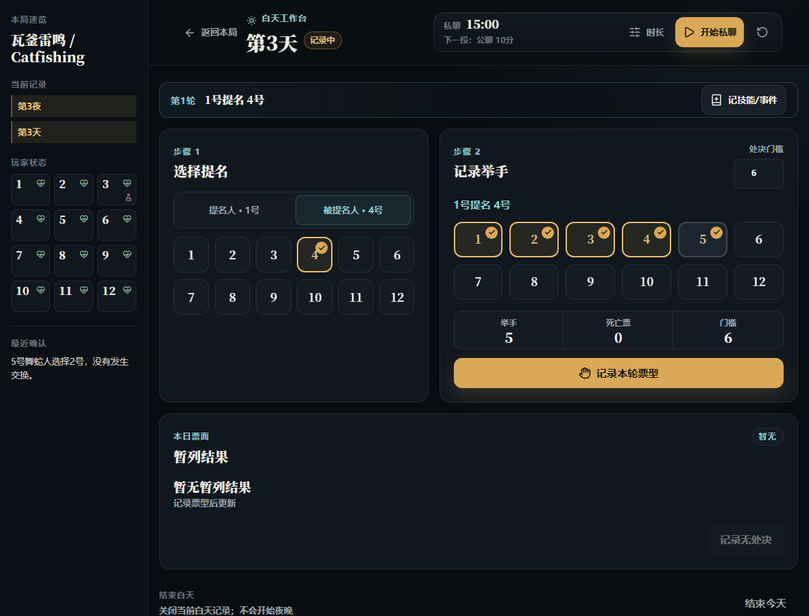
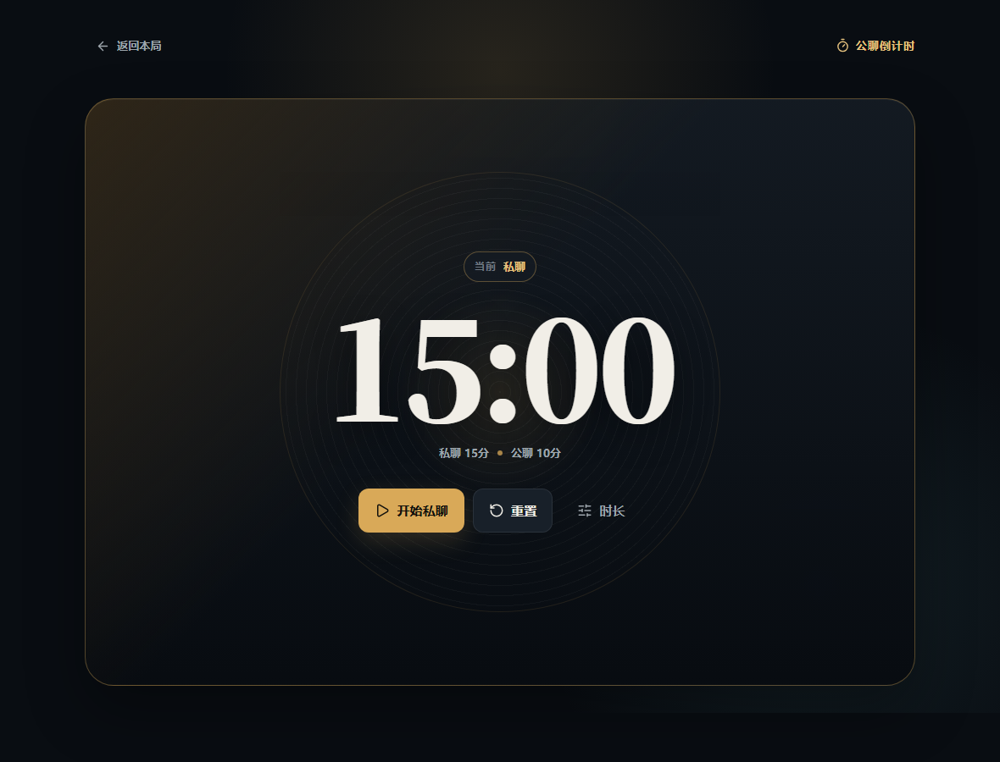
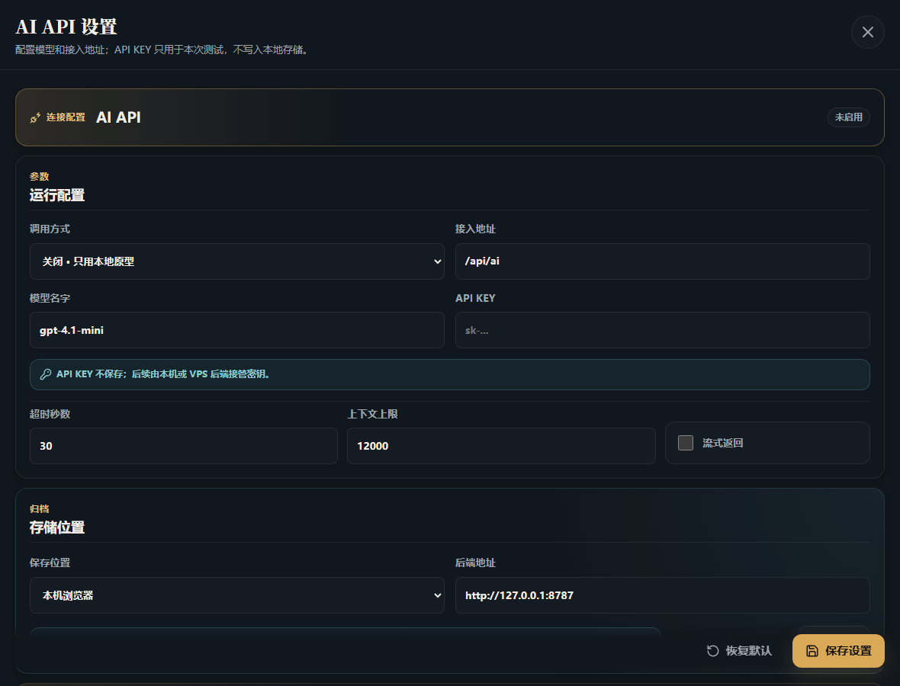
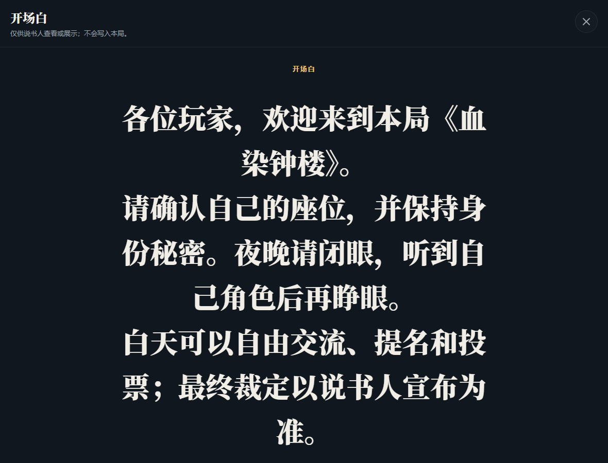
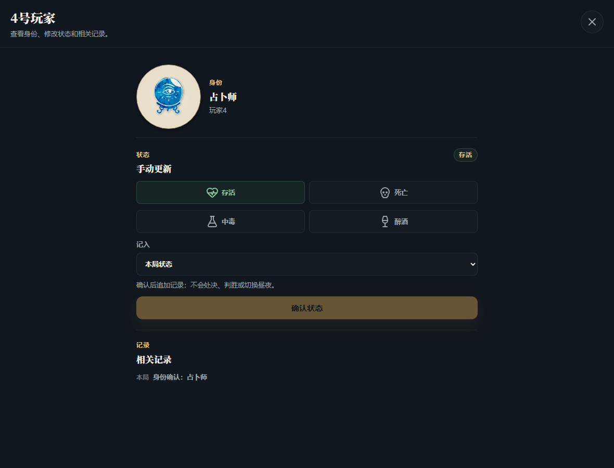
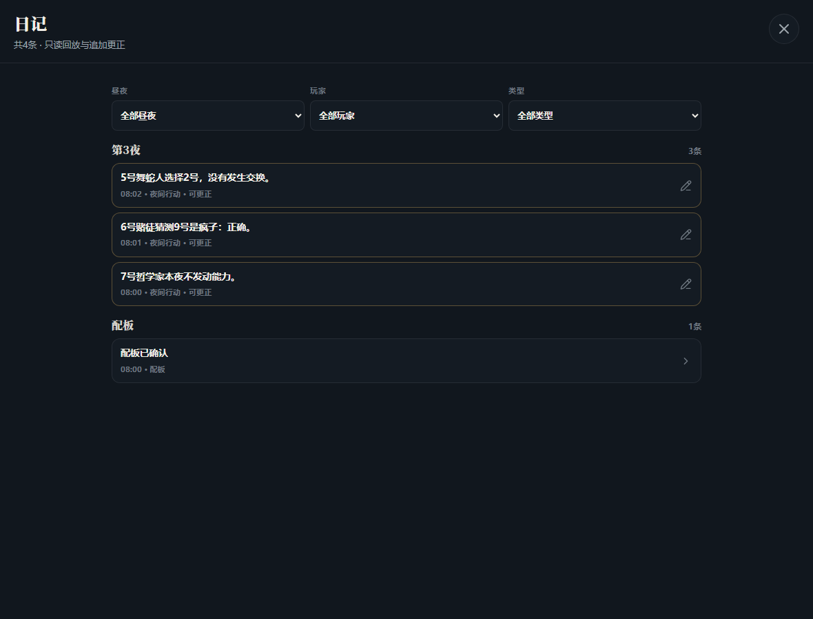

# 钟楼说书人副驾驶



Pad 优先的《血染钟楼》线下说书人辅助工具。它围绕官方/实体魔典工作：帮说书人完成智能配板草稿、夜间顺序辅助、白天投票、结构化日志、结束归档和 AI 复盘。

> 非官方社区项目。不代表 The Pandemonium Institute，也不替代官方魔典。AI 只提供草稿、提醒和建议；身份、阵营、死亡、毒醉、处决、胜负和昼夜推进都必须由说书人确认。

## 项目状态

`alpha / preview`

适合：

- 自用；
- 本地或自用 VPS 试跑；
- GitHub 早期预览；
- 模拟主持流程、AI 质量回归和 VPS 稳定性验证。

不适合宣传为：

- 正式稳定版；
- 官方工具；
- 官方魔典替代品；
- 自动规则引擎；
- 已通过真实线下局验证。

发布前验收口径见 `dev-docs/SMOKE_HOSTING_SCENARIOS.md`：模拟主持流程验收 + AI 质量回归 + VPS 稳定性验证。

## 它解决什么问题

线下说书人通常已经有官方/实体魔典负责空间局面，但仍然容易在这些地方出错：

- 开局配板要同时考虑人数、座位、玩家经验、角色冲突、趣味性和恶魔伪装；
- 夜晚要按夜序逐个唤醒，既要看技能，又要记目标、猜测角色、玩家状态和历史信息；
- 白天提名和投票需要记录每轮票型、死亡票、暂列、平票和最终处决；
- 说书人给信息、改信息、撤回误操作时，需要能追溯；
- 赛后复盘要从日志里快速找关键节点，而不是凭记忆翻手写纸。

这个工具的定位是：**记录台 + 夜序辅助 + AI 草稿顾问 + 复盘索引**。它不抢说书人的权威，也不替代官方魔典。

## 功能一览

| 场景 | 能做什么 | 明确不会做什么 |
| --- | --- | --- |
| 开局 | 7-15 人选板子、填昵称/经验、AI 生成配板候选、手动调整座位和角色 | 不自动发身份，不把 AI 候选当最终配板 |
| 智能板子 | 按板子维护角色池、夜序、模板库、setup 提醒和 AI 辅助知识 | 不把导入 JSON 当作已经理解规则 |
| 身份交接 | 单人屏幕领取、实体抽牌记录、领取进度追踪 | 不做常驻玩家端，不下发完整魔典 |
| 夜晚 | 当前局夜序筛选、逐个唤醒、目标/猜测/结果记录、AI 结算草稿 | 不自动执行技能，不自动改身份/阵营/死亡/毒醉 |
| 白天 | 私聊/公聊倒计时、白天技能记录、提名和票型、暂列处决 | 计票不直接杀人，不自动进入夜晚 |
| 日记 | 昼夜日志、状态变化、投票、更正记录、可追溯历史 | 更正不覆盖旧记录 |
| 复盘 | 保存归档、历史复盘、AI 评分/锐评草稿、关键节点摘录 | AI 复盘不是客观判决，不替代现场观察 |
| AI 设置 | 后端代理真实模型、前端只保存非敏感配置、AI 不可用时降级 | 不保存 API Key，不要求联网才能主持 |

## 截图导览

### 本局常驻面板

常驻面板是平板分屏时最常看的首页：当前阶段、常用入口、玩家状态、最近记录都放在这里。


### 智能板子库

切换板子时能看到智能板子的可用状态：已导入、可开局、需要复核、夜序/模板/规则知识是否完整。后续批量导入板子时，不会只剩一堆看不出质量的 JSON。



### AI 配板建议

AI 配板不是直接发身份，而是生成候选组合：每套候选有角色座位、风格标签、建议说明和可手动调整的草稿。说书人确认后才会进入本局记录。


### 身份交接

支持线下叫号领取身份：玩家按号码来到平板前，屏幕只聚焦展示当前玩家身份。也支持实体抽牌后把结果记录回系统。



### 夜晚工作台

夜晚页面按当前局角色筛选夜序，逐个唤醒。每一项都围绕“当前角色、当前玩家、目标、猜测、受到影响、AI 建议、确认记录”展开。


### 白天投票

白天页面记录提名人、被提名人、举手票型、票数门槛、暂列结果和最终处决。记录票型不会自动杀人，处决仍需说书人确认。



### 公聊倒计时

倒计时可以单独展开成聚焦页面，适合平板拿出来计时。默认先私聊，再公聊；时间可以调整。



### AI API 设置

AI 设置在右上角齿轮里。前端只保存非敏感配置，真实 API Key 走后端环境变量；AI 不可用时，核心记录流程仍能继续。



### 开场白展示

开场白可以编辑，也可以切成大字展示，用来在开局前快速说明座位、规则提醒和现场节奏。



### 玩家详情与日记

点击玩家能查看该玩家的身份、昵称和状态；日记按昼夜记录配板、技能、信息、状态、投票、处决和更正。





### 结束归档与复盘

结束对局时先保存归档，再决定是否重置。历史复盘会展示当局日志、关键节点、玩家评分草稿和 AI 锐评草稿。


## 一局游戏怎么用

1. **选择人数与板子**：选择 7-15 人，选择智能板子，必要时导入上一局昵称。
2. **AI 配板**：查看 2-3 套候选，参考节奏、风险、伪装建议和玩家经验提醒。
3. **人工确认**：说书人可以改角色、改昵称、交换座位；确认后才写入本局。
4. **发身份**：用单人屏幕展示或实体抽牌记录完成身份交接。
5. **进入夜晚**：按当前局夜序逐个唤醒，记录目标/猜测/结果，必要时请求 AI 建议。
6. **进入白天**：使用私聊/公聊倒计时，记录白天技能、提名、举手票型和暂列结果。
7. **确认处决**：只有说书人确认处决，玩家死亡状态才会更新。
8. **日记与更正**：误操作或信息修正会追加更正记录，不覆盖旧日志。
9. **结束归档**：保存本局，查看历史复盘；确认后再重置游戏。

## 核心能力

### 1. 本局常驻面板

- 显示当前阶段、板子、玩家状态和最近记录。
- 提供开场白、公聊倒计时、AI 配板、身份交接、切换板子、夜晚/白天入口。
- 玩家状态卡只投影当前确认状态；点击玩家可查看身份、昵称和状态。
- 重置对局后会清空玩家、状态、昼夜、夜晚记录、白天投票草稿和日志，引导重新开局。

### 2. 智能配板

- 支持 7-15 人开局。
- 基于智能板子包和模板库生成候选。
- 说明节奏、风险、伪装建议和可玩性。
- 支持玩家昵称和经验信息；未标注经验时默认标准玩家。
- 说书人可手动调整角色、昵称和座位。
- 采用候选前需要人工确认；AI 不直接发身份、不改权威状态。

### 3. 智能板子包

- 每个板子独立维护角色池、夜序、setup 提醒、模板库和 AI 辅助知识。
- 新增板子前要做规则调研；复杂角色需要补角色知识和回归测试。
- 板子质量面板会区分可开局、需复核、暂缓，避免大量板子导入后变成黑箱。

### 4. 身份交接

- 支持单人屏幕领取身份。
- 支持实体抽牌后的记录流程。
- 不做常驻玩家端，也不会把完整当局数据下发给玩家端再隐藏。

### 5. 夜晚工作台

- 按当前局角色筛选夜序。
- 逐个唤醒，记录目标、猜测角色、结算草稿和 AI 建议。
- AI 可给“受到影响/未受影响”的建议和说书人核对点。
- 复杂结果仍是草稿：死亡、换身份、改阵营、中毒、醉酒、疯狂处罚都不会自动执行。
- 完成本项只写记录，不自动进入白天。

### 6. 白天投票

- 记录提名人、被提名人、举手票型、死亡票、暂列处决和平票。
- “记录本轮票型”只写日志和暂列结果。
- 只有说书人确认处决，才会写入死亡状态。
- 结束白天不会自动进入夜晚。

### 7. 日记、更正、归档与复盘

- 按昼夜记录配板、技能、信息、状态、投票、处决和更正。
- 更正追加新记录，不覆盖旧记录。
- 结束对局可保存归档、查看历史复盘、生成 AI 复盘草稿、导出 JSON、确认后重置游戏。

### 8. AI 设置与真实模型

- 右上角齿轮配置 AI API。
- 前端只保存非敏感设置，不保存真实 API Key。
- 真实 AI 走后端代理；默认关闭。
- AI 不可用时，开局、夜序、投票、日志、计时和归档仍应可用。

## AI 权限边界

AI 可以：

- 给配板候选；
- 解释候选为什么适合当前人数/玩家经验；
- 给夜间技能结算建议；
- 给玩家信息文案草稿；
- 提醒缺少目标、缺少历史信息、状态冲突或高风险规则；
- 生成赛后复盘草稿和玩家锐评草稿。

AI 不可以：

- 自动发送身份；
- 自动执行技能；
- 自动改变身份、阵营、死亡、毒醉或疯狂状态；
- 自动判定胜负；
- 自动进入下一昼夜；
- 把建议写成权威裁定。

## 不做什么

- 不自动运行完整规则；
- 不自动判定胜负；
- 不自动改身份、阵营、死亡、毒醉；
- 不自动执行技能；
- 不同步或操作官方魔典；
- 不做常驻玩家端/收件箱；
- 不把 AI 建议当权威裁定；
- 不把官方/社区素材直接随公开仓库发布。

## 快速开始

```powershell
npm install
npm run dev
```

打开 Vite 输出的本地地址，默认进入“本局”。

## 本地后端

构建并启动本地 runtime：

```powershell
npm run dev:backend
```

默认：

- host: `127.0.0.1`
- port: `8787`
- archive data: `data/archives/archives.json`

可参考 `.env.example` 设置环境变量。

## AI 配置

真实 AI 走后端代理，前端只保存非敏感设置。不要把 API Key 写入源码或提交到 Git。

当前状态：

- 后端已有 OpenAI-compatible provider 配置和一次性 live test 入口。
- 默认 `BOTC_AI_ENABLED=false`，不调用真实模型。
- AI 配板、夜间结算和赛后复盘仍是草稿建议；不会自动改权威状态。
- 详细启动方式见 `dev-docs/AI_RUNTIME_STARTUP.md`。

环境变量示例：

```powershell
$env:BOTC_AI_ENABLED='true'
$env:BOTC_AI_PROVIDER='openai-compatible'
$env:BOTC_AI_BASE_URL='https://api.example.com/v1'
$env:BOTC_AI_MODEL='your-model-name'
$env:BOTC_AI_API_KEY='your-local-secret'
```

## 验证

```powershell
npm run check
npm run test:e2e
npm run smoke:backend
npm run smoke:ai-night-live
npm run audit:public
```

`audit:public` 用于拦截真实 API Key、本机个人路径和素材误提交风险。
`smoke:ai-night-live` 是可选真实模型抽查，运行前必须设置 `BOTC_AI_BASE_URL`、`BOTC_AI_MODEL` 和 `BOTC_AI_API_KEY`；默认检查不会调用真实模型。

刷新 GitHub 展示截图：

```powershell
npm run screenshots:github
```

## 公开仓库与素材包

代码可以公开整理；官方/社区二进制素材默认不提交。

本地素材目录：

- `public/assets/characters/`
- `public/assets/community/`

保留来源说明：

- `public/assets/characters/source-manifest.json`
- `public/assets/community/README.md`
- `THIRD_PARTY_NOTICES.md`

详细边界见 `dev-docs/PUBLIC_RELEASE_BOUNDARY.md`。

## 项目文档

- `dev-docs/README.md`：文档索引和当前路线。
- `dev-docs/PRODUCT_VISION.md`：产品定位。
- `dev-docs/AI_AUTHORITY_BOUNDARY.md`：AI 权限边界。
- `dev-docs/SCRIPT_ARCHITECTURE_PLAN.md`：智能板子包架构。
- `dev-docs/RULE_RESEARCH_PROTOCOL.md`：新增板子前的规则调研。
- `dev-docs/ABILITY_SETTLEMENT_BOUNDARY.md`：技能结算建议边界。
- `dev-docs/AI_INTEGRATION_PLAN.md`：真实 AI 接入和上下文最小化。
- `dev-docs/SMOKE_HOSTING_SCENARIOS.md`：模拟主持流程验收。
- `dev-docs/GITHUB_RELEASE_CHECKLIST.md`：GitHub 发布检查清单。
- dev-docs/GITHUB_PUBLICATION_STATUS.md：GitHub 公开发布状态。
- dev-docs/releases/alpha-preview-20260727.md：首个 alpha preview Release Notes 草稿。

## 第三方与免责声明

见 `THIRD_PARTY_NOTICES.md`。

本项目是社区制作的非官方辅助原型。Blood on the Clocktower、相关角色、概念、脚本、视觉资产和官方资源属于其各自权利人。

## License

The original source code and original project documentation in this repository are licensed under the MIT License. See `LICENSE`.

This MIT License does not grant any rights to Blood on the Clocktower, official or community scripts, role names, rules text, visual assets, trademarks, provider-owned materials, or any third-party content. See `THIRD_PARTY_NOTICES.md`.

中文说明：本仓库原创代码和原创项目文档按 MIT License 授权；但该授权不包含 Blood on the Clocktower 相关内容、官方/社区脚本、角色名、规则文本、视觉素材、商标或第三方提供方材料。
