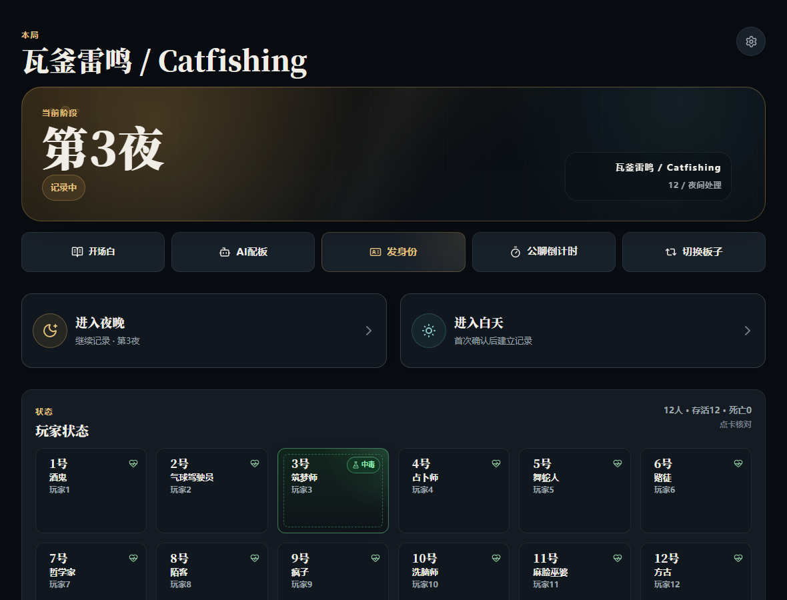
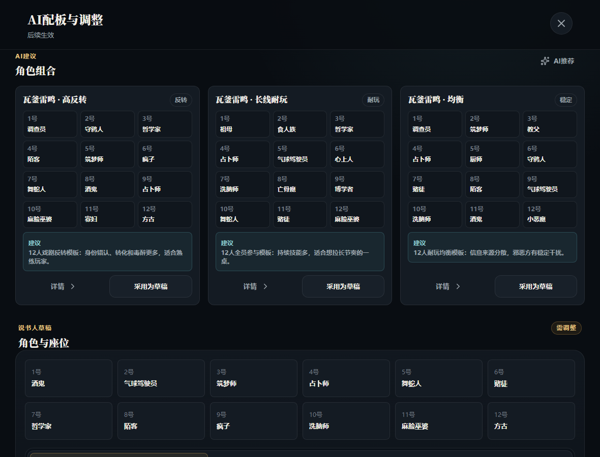
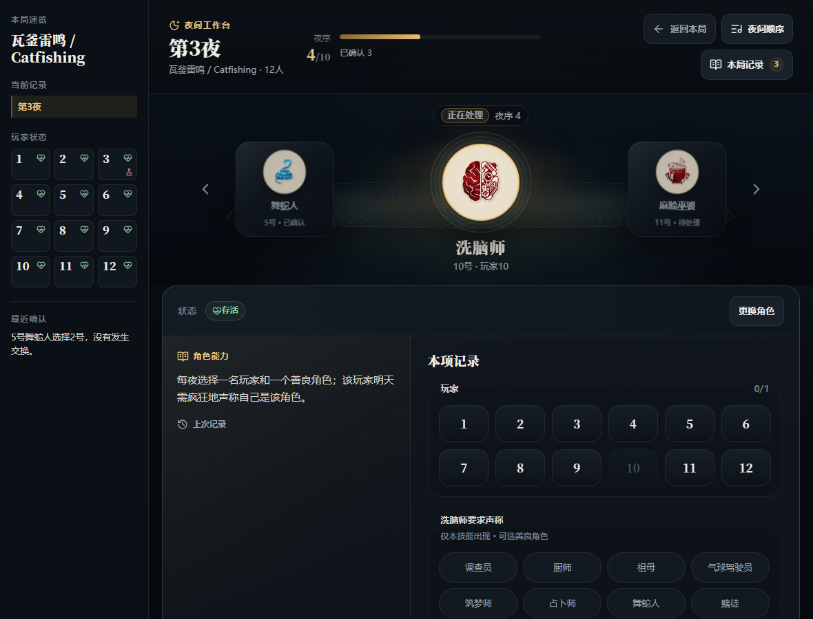
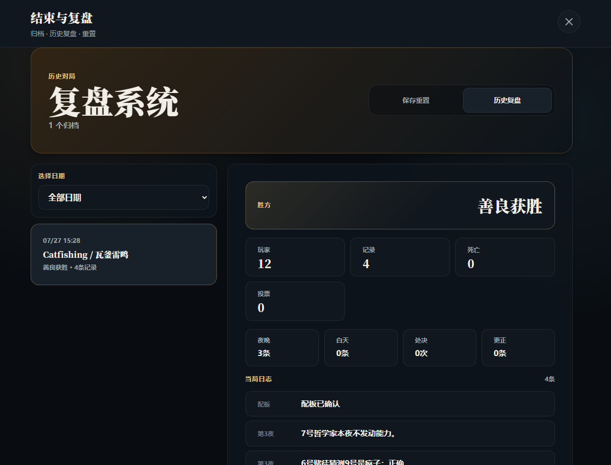

# 钟楼说书人副驾驶

Pad 优先的《血染钟楼》线下说书人辅助工具。它围绕官方/实体魔典工作：帮说书人完成智能配板草稿、夜间顺序辅助、白天投票、结构化日志、结束归档和 AI 复盘。

> 非官方社区项目。不代表 The Pandemonium Institute，也不替代官方魔典。AI 只提供草稿、提醒和建议；身份、阵营、死亡、毒醉、处决、胜负和昼夜推进都必须由说书人确认。

## 项目状态

`alpha / preview`

适合：

- 自用；
- 本地或自用 VPS 试跑；
- GitHub 早期预览；
- 模拟主持流程、AI 质量回归和 VPS 稳定性验证。

不适合宣传为：

- 正式稳定版；
- 官方工具；
- 官方魔典替代品；
- 自动规则引擎；
- 已通过真实线下局验证。

发布前验收口径见 `dev-docs/SMOKE_HOSTING_SCENARIOS.md`：模拟主持流程验收 + AI 质量回归 + VPS 稳定性验证。

## 界面预览

| 本局常驻面板 | AI 配板建议 |
| --- | --- |
|  |  |

| 夜晚工作台 | 白天投票 |
| --- | --- |
|  |  |

| 结束归档与复盘 |
| --- |
|  |

## 核心能力

### 1. 本局常驻面板

- 显示当前阶段、板子、玩家状态和最近记录。
- 提供开场白、公聊倒计时、AI 配板、身份交接、切换板子、夜晚/白天入口。
- 玩家状态卡只投影当前确认状态；点击玩家可查看身份、昵称和状态。

### 2. 智能配板

- 支持 7-15 人开局。
- 基于智能板子包和模板库生成候选。
- 说明节奏、风险、伪装建议和可玩性。
- 说书人可手动调整角色、昵称和座位。
- 采用候选前需要人工确认；AI 不直接发身份、不改权威状态。

### 3. 身份交接

- 支持单人屏幕领取身份。
- 支持实体抽牌后的记录流程。
- 不做常驻玩家端，也不会把完整当局数据下发给玩家端再隐藏。

### 4. 夜晚工作台

- 按当前局角色筛选夜序。
- 逐个唤醒，记录目标、猜测角色、结算草稿和 AI 建议。
- AI 可给“受到影响/未受影响”的建议和说书人核对点。
- 复杂结果仍是草稿：死亡、换身份、改阵营、中毒、醉酒、疯狂处罚都不会自动执行。

### 5. 白天投票

- 记录提名人、被提名人、举手票型、死亡票、暂列处决和平票。
- “记录本轮票型”只写日志和暂列结果。
- 只有说书人确认处决，才会写入死亡状态。

### 6. 日记、更正、归档与复盘

- 按昼夜记录配板、技能、信息、状态、投票、处决和更正。
- 更正追加新记录，不覆盖旧记录。
- 结束对局可保存归档、查看历史复盘、生成 AI 复盘草稿、导出 JSON、确认后重置游戏。

### 7. AI 设置

- 右上角齿轮配置 AI API。
- 前端只保存非敏感设置，不保存真实 API Key。
- 真实 AI 走后端代理；默认关闭。
- AI 不可用时，开局、夜序、投票、日志、计时和归档仍应可用。

## 不做什么

- 不自动运行完整规则；
- 不自动判定胜负；
- 不自动改身份、阵营、死亡、毒醉；
- 不自动执行技能；
- 不同步或操作官方魔典；
- 不做常驻玩家端/收件箱；
- 不把 AI 建议当权威裁定；
- 不把官方/社区素材直接随公开仓库发布。

## 快速开始

```powershell
npm install
npm run dev
```

打开 Vite 输出的本地地址，默认进入“本局”。

## 本地后端

构建并启动本地 runtime：

```powershell
npm run dev:backend
```

默认：

- host: `127.0.0.1`
- port: `8787`
- archive data: `data/archives/archives.json`

可参考 `.env.example` 设置环境变量。

## AI 配置

真实 AI 走后端代理，前端只保存非敏感设置。不要把 API Key 写入源码或提交到 Git。

当前状态：

- 后端已有 OpenAI-compatible provider 配置和一次性 live test 入口。
- 默认 `BOTC_AI_ENABLED=false`，不调用真实模型。
- AI 配板、夜间结算和赛后复盘仍是草稿建议；不会自动改权威状态。
- 详细启动方式见 `dev-docs/AI_RUNTIME_STARTUP.md`。

环境变量示例：

```powershell
$env:BOTC_AI_ENABLED='true'
$env:BOTC_AI_PROVIDER='openai-compatible'
$env:BOTC_AI_BASE_URL='https://api.example.com/v1'
$env:BOTC_AI_MODEL='your-model-name'
$env:BOTC_AI_API_KEY='your-local-secret'
```

## 验证

```powershell
npm run check
npm run test:e2e
npm run smoke:backend
npm run smoke:ai-night-live
npm run audit:public
```

`audit:public` 用于拦截真实 API Key、本机个人路径和素材误提交风险。
`smoke:ai-night-live` 是可选真实模型抽查，运行前必须设置 `BOTC_AI_BASE_URL`、`BOTC_AI_MODEL` 和 `BOTC_AI_API_KEY`；默认检查不会调用真实模型。

刷新 GitHub 展示截图：

```powershell
npm run screenshots:github
```

## 公开仓库与素材包

代码可以公开整理；官方/社区二进制素材默认不提交。

本地素材目录：

- `public/assets/characters/`
- `public/assets/community/`

保留来源说明：

- `public/assets/characters/source-manifest.json`
- `public/assets/community/README.md`
- `THIRD_PARTY_NOTICES.md`

详细边界见 `dev-docs/PUBLIC_RELEASE_BOUNDARY.md`。

## 项目文档

- `dev-docs/README.md`：文档索引和当前路线。
- `dev-docs/PRODUCT_VISION.md`：产品定位。
- `dev-docs/AI_AUTHORITY_BOUNDARY.md`：AI 权限边界。
- `dev-docs/SCRIPT_ARCHITECTURE_PLAN.md`：智能板子包架构。
- `dev-docs/RULE_RESEARCH_PROTOCOL.md`：新增板子前的规则调研。
- `dev-docs/ABILITY_SETTLEMENT_BOUNDARY.md`：技能结算建议边界。
- `dev-docs/AI_INTEGRATION_PLAN.md`：真实 AI 接入和上下文最小化。
- `dev-docs/SMOKE_HOSTING_SCENARIOS.md`：模拟主持流程验收。
- `dev-docs/GITHUB_RELEASE_CHECKLIST.md`：GitHub 发布检查清单。

## 第三方与免责声明

见 `THIRD_PARTY_NOTICES.md`。

本项目是社区制作的非官方辅助原型。Blood on the Clocktower、相关角色、概念、脚本、视觉资产和官方资源属于其各自权利人。

## License

The original source code and original project documentation in this repository are licensed under the MIT License. See `LICENSE`.

This MIT License does not grant any rights to Blood on the Clocktower, official or community scripts, role names, rules text, visual assets, trademarks, provider-owned materials, or any third-party content. See `THIRD_PARTY_NOTICES.md`.

中文说明：本仓库原创代码和原创项目文档按 MIT License 授权；但该授权不包含 Blood on the Clocktower 相关内容、官方/社区脚本、角色名、规则文本、视觉素材、商标或第三方提供方材料。
