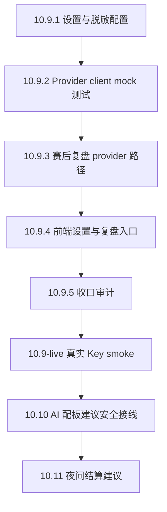

# AI Provider 10.9 实现计划

状态：**实现计划已冻结 / 第一批安全脚手架可推进 / live 调用仍需 Key 与费用确认**。  
依据：用户确认“按推荐方案走”，即后端代理、OpenAI-compatible 优先、API Key 只放后端、默认 `minimal` 上下文、失败回退 fake/local/manual、首个功能先做赛后复盘。

## 1. 总目标

把当前 fake AI 复盘能力升级为可切换的后端 AI provider 架构：

```text
前端复盘按钮
  -> 现有 service / adapter
  -> 后端 archive review-draft route
  -> AI proxy handler
  -> OpenAI-compatible provider client
  -> draft-only AIReviewDraft
  -> 说书人查看 / 采用 / 忽略
```

第一版只追求：

- 赛后复盘可走真实 provider。
- Provider 未配置或失败时不影响归档、重置、夜晚、白天、投票和手动复盘。
- API Key 不进入前端、不落 localStorage、不进归档、不进日志。
- AI 返回仍是草稿，不改权威状态。

## 2. 阶段拆分

### 10.9.1 后端 AI 设置与脱敏公开配置

目标：建立后端读取 AI 环境变量和公开设置的基础能力。

可改文件：

- `server/ai/aiProviderSettings.ts`
- `server/ai/aiErrors.ts`
- `server/ai/aiProxyRoutes.ts`
- `server/ai/aiProxyHandlers.ts`
- `server/runtime.ts` 或当前 runtime mount 文件中的最小挂载点
- `server/ai/*.test.ts`
- `dev-docs/API_CONTRACT.md`

边界：

- 不调用 provider。
- 不保存 API Key。
- 不新增 SDK。
- 不让前端提交 API Key。

建议接口：

```http
GET /api/settings/ai
POST /api/settings/ai/test
```

`GET /api/settings/ai` 只返回：

```ts
type PublicAISettings = {
  mode: 'off' | 'backend_proxy'
  provider: 'fake' | 'openai-compatible'
  baseUrl?: string
  model?: string
  timeoutSeconds: number
  contextLimit: number
  apiKeyConfigured: boolean
}
```

验收：

- 未配置 key 时返回 `apiKeyConfigured: false`。
- 配置 key 时只返回 `apiKeyConfigured: true`，不返回 key 或 maskedKey 以外的敏感信息。
- `process.env.BOTC_AI_API_KEY` 不出现在 response、console、错误对象。
- `npm run test:server`、`npm run smoke:backend`、`npm run check` 通过。

### 10.9.2 Provider client 骨架与 mock fetch 测试

目标：实现 OpenAI-compatible client，但所有测试使用注入 fetch，不做真实网络调用。

可改文件：

- `server/ai/aiProviderClient.ts`
- `server/ai/aiProviderClient.test.ts`
- `server/ai/aiErrors.ts`

边界：

- 不读取真实 API Key 做 live 请求。
- 不新增 OpenAI / Claude SDK。
- 不把完整 prompt 或 headers 打日志。
- 不把 provider 原始响应直接透传到前端。

Client 要求：

- 支持超时。
- 支持 mock fetch 注入。
- 将 401/403/429/5xx/timeout/bad json 映射成项目错误码。
- 只输出经过 schema/shape 解析后的草稿字段。

验收：

- mock 成功响应可解析。
- mock 429 返回 `AI_PROVIDER_RATE_LIMITED`。
- mock 超时返回 `AI_PROVIDER_TIMEOUT`。
- mock 坏 JSON 返回 `AI_PROVIDER_BAD_RESPONSE`。
- 测试中断言 key 不出现在错误 message。
- `npm run test:server`、`npm run check` 通过。

### 10.9.3 赛后复盘真实 provider 路径

目标：把 `POST /api/archives/:archiveId/review-draft` 改成可按后端配置选择 fake 或 real provider。

可改文件：

- `server/archive/httpArchiveRoutes.ts` 或当前 review-draft route
- `server/archive/reviewDraft.ts`
- `server/ai/aiProxyHandlers.ts`
- `server/ai/reviewPromptBuilder.ts`
- `server/**/*.test.ts`

边界：

- 默认 fake/local 仍可用。
- Provider 关闭或配置缺失时不失败整个归档详情页。
- 不自动写回归档，除非已有明确“保存草稿”的后续功能。
- 不生成公开排行榜或长期玩家画像。

上下文：

- 默认 `minimal`：归档摘要、胜方、人数、记录计数。
- 不默认发送完整日志。
- 若以后需要详细复盘，另开手动入口。

验收：

- fake 路径与旧测试兼容。
- real provider 路径用 mock fetch 验证。
- provider 失败时返回结构化错误或 fallback 草稿，不破坏归档读取。
- 返回 `provider: 'openai-compatible'` 时仍有 `disclaimer`。
- `draftOnly`/“草稿”语义不丢。
- `npm run test:server`、`npm run smoke:backend`、`npm run check` 通过。

### 10.9.4 前端 AI 设置与复盘入口安全接线

目标：前端展示后端 AI 配置状态，并允许复盘页请求后端生成草稿。

可改文件：

- `src/features/settings/AISettingsSheet.tsx`
- `src/services/settings/settingsService.ts`
- `src/services/ai/*` 或新增前端 AI HTTP adapter
- `src/features/game-review/*` 或当前复盘入口组件
- 相关测试与 E2E

边界：

- 前端不保存 API Key。
- 如果保留临时测试输入框，必须 `autoComplete="new-password"`，提交后清空。
- UI 不能暗示“AI 已经客观评分玩家”。
- 复盘失败不能影响历史归档查看。

验收：

- localStorage 不包含 `sk-`、`apiKey`、`authorization` 等敏感字段。
- 后端未配置时 UI 显示“AI 未启用 / 使用本地草稿”。
- 复盘按钮失败后有明确提示，不空白。
- `npm run check` 通过。
- 如改 UI，补 Playwright smoke 或测试。

### 10.9.5 收口审计与外部复审包

目标：检查 10.9.1-10.9.4 是否越界，并准备外部审查。

产物：

- `dev-docs/AI_PROVIDER_10_9_CLOSURE_AUDIT.md`
- `dev-docs/CLAUDE_AI_PROVIDER_10_9_REVIEW_PROMPT.md`
- 更新 `dev-docs/HUMAN_CHANGELOG.md`
- 更新 `dev-docs/UNATTENDED_TASK_INDEX.md`

验收：

- `npm run test:server` 通过。
- `npm run smoke:backend` 通过。
- `npm run check` 通过。
- 审计明确：是否发生真实网络调用；是否需要 live smoke。

### 10.9-live 真实 Key / 真实网络 smoke

状态：**接口与 UI 已开放 / 真实外部调用仍由说书人手动触发**。

用户已确认允许推进到真实连通测试，但执行边界收紧为：

- 后端新增 `POST /api/settings/ai/live-test`。
- 前端新增“校验配置”和“真实连通测试”两个按钮，避免把本地校验误认为真实请求。
- API KEY 只允许作为一次性请求体提交给本机或 HTTPS 后端，不写入 localStorage、归档、日志或响应。
- Codex 不从截图、DOM 或浏览器密码框读取 Key；真实外部 smoke 由说书人在 UI 中手动点击。

10.9-live 只验证“能否连通 provider”，不代表 AI 配板、夜间结算或赛后复盘默认切到真实 AI。

## 3. 推荐实现顺序



10.10、10.11 不应在 10.9 中自动跨过去；后续必须有独立授权和收口审计。

## 4. 目录与文件预算

新增后端目录建议：

```text
server/ai/
  aiErrors.ts
  aiProviderSettings.ts
  aiProviderClient.ts
  aiProxyHandlers.ts
  aiProxyRoutes.ts
  reviewPromptBuilder.ts
```

预算：

| 文件类型 | 建议上限 |
|---|---:|
| route | 140 行 |
| handler | 180 行 |
| provider client | 180 行 |
| prompt builder | 180 行 |
| settings | 140 行 |
| tests | 可超过，但按行为拆文件 |

如果 `runtime.ts` 需要大改，必须停下来，优先新增小模块而不是往 runtime 里塞。

## 5. 错误码

新增或确认以下错误码：

| code | HTTP | 场景 |
|---|---:|---|
| `AI_PROVIDER_DISABLED` | 503 | `BOTC_AI_ENABLED !== true` |
| `AI_PROVIDER_UNCONFIGURED` | 503 | 缺 baseUrl/model/apiKey |
| `AI_PROVIDER_TIMEOUT` | 504 | provider 超时 |
| `AI_PROVIDER_RATE_LIMITED` | 429 | provider 限流 |
| `AI_PROVIDER_BAD_RESPONSE` | 502 | provider 返回不符合合同 |
| `AI_PROVIDER_UNAVAILABLE` | 503 | 网络/服务不可用 |
| `BAD_REQUEST` | 400 | 请求体错误 |

错误响应不得包含：

- API Key。
- Authorization header。
- 完整 prompt。
- provider 原始敏感响应。

## 6. Prompt 与上下文边界

第一版 review prompt builder 只允许 minimal：

```ts
type ReviewProviderPromptInput = {
  archiveId: string
  scriptName: string
  playerCount: number
  winnerLabel: string
  summary: {
    records: number
    nightActions: number
    dayActions: number
    votes: number
    executions: number
    corrections: number
    alive: number
    dead: number
  }
  reviewStyle: 'neutral' | 'sharp'
  includePlayerScores: boolean
}
```

禁止字段：

- `session` 完整对象。
- `timeline` 完整正文。
- `players` 完整身份列表，除非进入详细复盘阶段且另行确认。
- 任意本地设置或 API Key。

## 7. 安全检查清单

实现每阶段后必须检查：

- [ ] 搜索 `BOTC_AI_API_KEY`，确认只在 server 配置读取处出现。
- [ ] 搜索 `apiKey`，确认前端不持久化。
- [ ] 搜索 `localStorage`，确认没有保存 key。
- [ ] 测试错误对象不包含 key。
- [ ] route 不直接改 archive/session/player state。
- [ ] provider 失败不影响手动流程。
- [ ] 文档和 task index 已更新。

建议命令：

```powershell
rg "BOTC_AI_API_KEY|apiKey|Authorization|localStorage" server src dev-docs
npm run test:server
npm run smoke:backend
npm run check
```

## 8. 当前可立即开始的任务

可以无人推进的安全任务：

1. 10.9.1 后端 AI 设置与脱敏公开配置。
2. 10.9.2 Provider client 骨架与 mock fetch 测试。
3. 10.9.3 赛后复盘 provider 路径，但只能 mock provider，不做 live 调用。
4. 10.9.4 前端设置与复盘入口安全接线，仍不得保存 Key。
5. 10.9.5 收口审计。

历史停止项：

- 10.11 夜间结算建议原本为高风险停止项；用户已在 2026-07-20 明确授权进入该阶段，实际实现见 `AI_NIGHT_SETTLEMENT_10_11_CLOSURE_AUDIT.md`。

## 9. 完成定义

10.9 实现阶段完成，不包括 live smoke，必须满足：

- 后端能读取脱敏 AI 配置。
- provider client 有 mock fetch 单元测试。
- 赛后复盘 route 能在 mock provider 下返回真实 provider 形状草稿。
- provider 失败时能回退或返回结构化错误。
- 前端不保存 Key。
- `npm run test:server` 通过。
- `npm run smoke:backend` 通过。
- `npm run check` 通过。
- `AI_PROVIDER_10_9_CLOSURE_AUDIT.md` 完成。

## 10. 当前状态

10.9.1-10.9.5 已完成并收口；10.9-live 已开放一次性手动连通测试；10.10 已完成 AI 配板建议安全接线；10.11 已完成夜间结算建议安全接线。

后续新增智能板子导入仍应作为独立阶段，继续遵守 `RULE_RESEARCH_PROTOCOL.md` 和 `SCRIPT_ROLE_ACCEPTANCE_CHECKLIST.md`。
